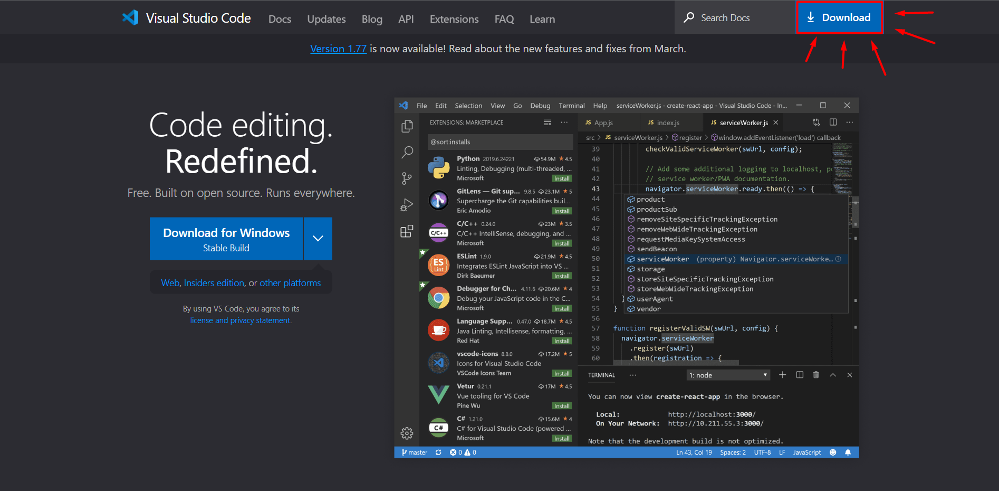
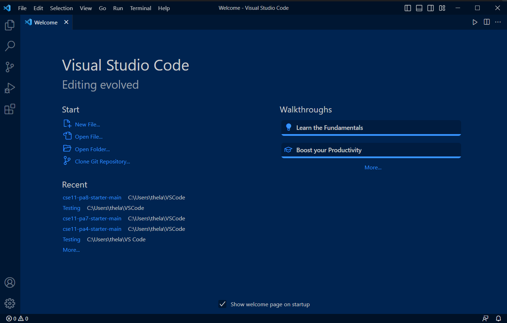

# **Lab Report 1**
This is a step-by-step guide on how to access your course-specific account on ieng6
## **STEP 1: Installing VS Code**
*If you have done so already, you can skip this step*
1. Go to the [Visual Studio Code Website](https://code.visualstudio.com/)

2. Click on the download link shown above in red
3. Install the file matching on your operating system (Windows, Linux, Mac)
4. After installing, open VS Code and it should look something like this:

