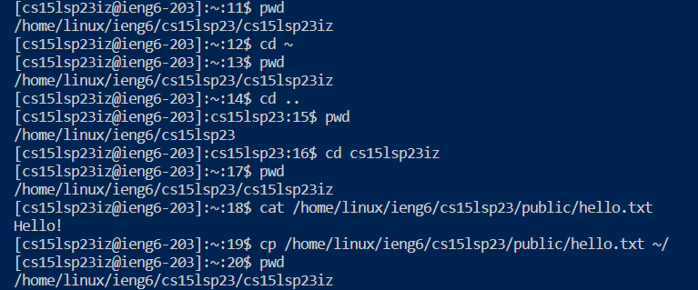

# **Lab Report 1**
This is a step-by-step guide on how to access your course-specific account on ieng6 using the terminal in VS Code

## **STEP 1: Installing VS Code**
*If you have done so already, you can skip this step*
1. Go to the [Visual Studio Code Website](https://code.visualstudio.com/)
  
2. Click on the download link shown above in red  
3. Install the file matching on your operating system (Windows, Linux, Mac)  
4. After installing, open VS Code and it should look something like this:  

---

### **(WINDOWS ONLY!!!) STEP 1.5: Git Bash and VS Code**
*If you have already set the default terminal in VS Code to use Git Bash, then you can skip this step*
1. Go to the [Git for Windows Website](https://gitforwindows.org/)  

2. Click on the download link shown above in red  
3. Follow this [Stack Overflow post](https://stackoverflow.com/questions/42606837/how-do-i-use-bash-on-windows-from-the-visual-studio-code-integrated-terminal/50527994#50527994) that will explain how to set your default terminal in VS Code to use Git Bash  
---

## **STEP 2: Remotely Connecting**
1. In VS Code, open the terminal by going to `terminal` -> `new terminal` or with the shortcut `Ctrl` + ``` ` ```. You should see something like this:  

2. Type `ssh <course-specific account>@ieng6.ucsd.edu` where `<course-specific account>` is your course-specific account and press `Enter`  
3. Enter your password and you should get something like this:  
* **NOTE:** When typing in your password, you will NOT be able to see any characters being typed, but keep in mind that this is normal and whatever you type is being inputted!  

---

## **STEP 3: Trying Some Commands**
Now that we have access to the our account on ieng6, we should try running some commands!
Here is a list of commands and their function:
```
pwd "Print Working Directory"
ls "List"
cd "Change Directory"
cp "Change Path"
mkdir "Make Directory"
cat "Concatenate"
```
Here are some examples of these commands:  
`ls -lat`  


`cd ~, cd .., cd, cat, cp`  


* **NOTE:** When finished, you can log out of the remote server by typing and entering `Exit`
