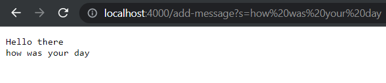

# **Lab Report 2 - Servers and Bugs (Week 3)**
* This lab involves working with Servers & URLs and Debugging

## **Part 1 - StringServer**
* This part demonstrates the ability to write a web server that prints out a message in a new line for the incoming request: `/add-message?s=<string>`

### **My code for StringServer:**
```
import java.io.IOException;
import java.net.URI;

class Handler3 implements URLHandler {
    String msg = "";
    String[] params;

    public String handleRequest(URI url) {
        if (url.getPath().equals("/")) {
            return String.format("");
        } else if (url.getPath().equals("/add-message")) {
            params = url.getQuery().split("=");
            if (params[0].equals("s")) {
                if (msg != "") { msg += "\n";}
                msg += params[1];
            }
            return msg;
        } else {
            System.out.println("Path: " + url.getPath());
            if (url.getPath().contains("/add")) {
                return "Maybe you meant: add-message?s=<your_message>";
            }
            return "404 Not Found!";
        }
    }
}

class StringServer {
    public static void main(String[] args) throws IOException {
        if(args.length == 0){
            System.out.println("Missing port number! Try any number between 1024 to 49151");
            return;
        }
        int port = Integer.parseInt(args[0]);
        Server.start(port, new Handler3());
    }
}
```
 
### First run of `/add-message` 

 
**Before:** The `StringServer main method` is called first and takes a `port` number argument from the user (in this case, 4000). Then, the `port` number and an instance of our `Handler3` class are passed as arguments to the `start` method from our `Server` class, where it creates our server.
 
1. Adding `/add-message?s=Hello there` to our URL as shown above causes our server run the code to handle the request, passing our URL as an argument to the `handleRequest method`.
2. The `url.getPath()` method checks the path of our URL and returns true in the `else-if` statement because our url path is `/add-message`.
3. Here, we set a String array **instance variable** `params` to be the String elements separated by `=` using the `split` method on the query, which is the portion of the URL after `?` that is obtained by the `url.getQuery()` method.
4. Next, we check that the first element of the `params` array is `s`.
5. Since our String **instance variable** `msg` is empty (which means that this is the first message!), we simply concatenate the second element of `params` to `msg`.
6. Lastly, we return `msg` to output in our web server!
 
### Second run of `/add-message`

 
1. Adding `/add-message?s=how was your day` to our URL as shown above runs almost identically to the previous run. But in short:
    1. The server passes our URL to the `handleRequest` method as an argument
    2. `url.getPath()` checks the URL path and returns true in the `else-if` statement since the path is `/add-message`
    3. **instance variable** `params` gets updated to be `{s, how was your day}` from `getQuery()` and `split` 
    4. Then we check that the first element of `params` is `s`.
2. Now because our web server never restarted, the **instance variable** `msg` still contains `Hello there` from the previous run.
3. Therefore, since `msg` is NOT empty, we concatenate a `\n` to our `msg`, which proceeds to the next line.
4. Then, we concatenate the second element of `params` to `msg`
5. Lastly, we return `msg` to output in our web server, which will have our second message be printed on a new line as shown above
 
## **Part 2 - Debugging**
* This part demonstrates the ability to use JUnit tool to test buggy programs. We find a failure-inducing input to find symptoms of our program output, in which we use to help identify the bug in our code. 
* Here, we will test the method `averageWithoutLowest`.
* Functionality of `averageWithoutLowest`:
```
// Averages the numbers in the array (takes the mean), but leaves out the
// lowest number when calculating. Returns 0 if there are no elements or just
// 1 element in the array
```
 
#### **Failure-Inducing Input in JUnit:**
```
@Test
public void testAvg2Lowest() {
  double[] twoLowest = {2.0, 2.0, 2.5, 3.5};
  assertEquals(ArrayExamples.averageWithoutLowest(twoLowest), 3.0, 0);
}
```
* **Note:** We expect the method to identify `2.0` as the lowest value and hence, will not account for it when calculating the average. So we have `2.5 + 3.5 = 6.0 / 2 = 3.0`

#### **NON-failure-inducing Input in JUnit:**
```
@Test
public void testAvgLowestPosition() {
  double[] lowestFirst = {1.0, 2.5, 3.5};
  double [] lowestMiddle = {2.5, 1.0, 3.5};
  double [] lowestEnd = {2.5, 3.5, 1.0};

  assertEquals(ArrayExamples.averageWithoutLowest(lowestFirst), 3.0, 0);
  assertEquals(ArrayExamples.averageWithoutLowest(lowestMiddle), 3.0, 0);
  assertEquals(ArrayExamples.averageWithoutLowest(lowestEnd), 3.0, 0);
}
```
* **Note:** Here, we test three different arrays with the same set of numbers, except the lowest value is located in different positions. We test if the program can correctly identify the lowest value of the array and also account for it when calculating the average.
 
#### **Symptom from compiling and then running the JUnit tests:**
 

