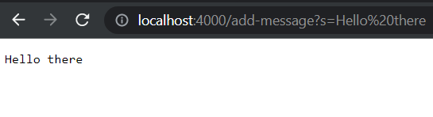

# **Lab Report 2 - Servers and Bugs (Week 3)**
* This lab involves working with Servers & URLs and Debugging

## **Part 1 - StringServer**
* This part demonstrates the ability to write a web server that prints out a message in a new line for the incoming request: `/add-message?s=<string>`

### **My code for StringServer:**
```
import java.io.IOException;
import java.net.URI;

class Handler3 implements URLHandler {
    String msg = "";
    String[] params;

    public String handleRequest(URI url) {
        if (url.getPath().equals("/")) {
            return String.format("");
        } else if (url.getPath().equals("/add-message")) {
            params = url.getQuery().split("=");
            if (params[0].equals("s")) {
                if (msg != "") { msg += "\n";}
                msg += params[1];
            }
            return msg;
        } else {
            System.out.println("Path: " + url.getPath());
            if (url.getPath().contains("/add")) {
                return "Maybe you meant: add-message?s=<your_message>";
            }
            return "404 Not Found!";
        }
    }
}

class StringServer {
    public static void main(String[] args) throws IOException {
        if(args.length == 0){
            System.out.println("Missing port number! Try any number between 1024 to 49151");
            return;
        }
        int port = Integer.parseInt(args[0]);
        Server.start(port, new Handler3());
    }
}
```

### first run of `/add-message` 

 
**Before:** The `StringServer main method` is called first and takes a `port` number argument from the user. Then, the `port` number and an instance of our `Handler3` class are passed as arguments to the `start` method from our `Server` class, where it creates our server.
 
1. Adding `/add-message?s=Hello there` to our URL as shown above causes our server run the code to handle the request.
2. Because the url path is `/add-message`, our program iterates through our `else-if` statement. 
3. Here, we set a String array called `params` to be the String elements separated by `=` after the query, which is the portion of the URL after `?`.
4. Next, we check if the first element of the `params` array is `s`.
    1. If it is, we check to see if our String instance variable `msg` is empty (which means that this is the first message!). 
    2. If it is NOT empty, we must concatenate `\n` to `msg` in order to skip to a new line. Then, we concatenate the second element of `params` to `msg`.
5. Lastly, we return `msg` to output in our web server!

