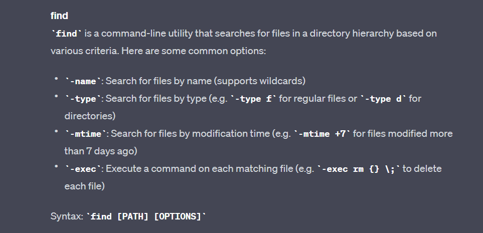

# **Lab Report 3 - Researching Commands (Week 5)**
* The task at hand is to select *one* of the bash commands that we learned in lecture: `find`, `less`, `grep`.
* Research 4 different options and give 2 examples using the `./technical` directory that we have been working with.
 
## Chat-GPT!
* Before I select a command to research, I was curious to see how effective [Chat-GPT](https://openai.com/) would be in helping me get the information for these commands.
* So I did exactly just that:
 
### Prompt:

 
### Chat-GPT Response:
#### `Grep`:

####  `Find`:

#### `Less`:

 
* Even though Chat-GPT doesn't give us every option, I still feel like its pretty interesting to see!

## **Grep:**
* For this lab, I decided to go with the `grep` command because it was the most confusing to me and so I want to tackle it to get a better understanding!
* From earlier, the commands that seemed interesting to me were `-v`, `-w`, `-n`, and `-m`
* **NOTE:** I did ask Chat-GPT again for a list of ALL options or flags using grep. To prevent this write-up from being too lengthy of Chat-GPT screenshots, I will briefly just say that only `-m` is the only 'new' option obtained from this search.

## 1. `-v`
* According to AI, this option **inverts** our grep search, in which it will show lines that **don't** match the given pattern.
#### Prior Work: 
* *Note that I added ... to make it less lengthy!*
 
```
wc -l technical/911report/*.txt | sort
    108 technical/911report/preface.txt
    603 technical/911report/chapter-10.txt
  . 
  .
  .
   3159 technical/911report/chapter-3.txt
   3237 technical/911report/chapter-13.5.txt
  25728 total
```
* I used the recently learned "Pipe" command to take the output from `wc` and used it as input to `sort`
* We have 25728 total lines from all the text files from 911report.
##### Example 1:
```
$ grep -v "murder" technical/911report/*.txt | wc -l | sort
25721
```
* Note that I used the "Pipe" command again to use my `grep` output as an input into `wc` and then into `sort`. I find this technique to be very useful!
* Here, we use the `-v` option so that we can count the number of lines that do **not** contain "murder". It turns out we can deduce that 7 lines contain the word "murder". This command can be useful in filtering out what we do not want.

##### Example 2: 
```
$ grep -v -e "murder" -e "blood" -e "police" -e "poison" -e "fire" technical/911report/*.txt | wc -l | sort
25422
```
* Now here is a stronger example. Suppose that I wanted lines that do not contain "murder", "blood", "police", "poison", or "fire". Then, I'd be able to use the `-e` option along with `-v` in order to make a stronger filter to give me what I want. In this case, we can see that there are 306 lines that contain either one or more of these words. Therefore, `-v` is a very powerful tool that can be used in combination with other commands to create a filter of what a user might not want in an output.

## 2. `-w`
* Our good friend Chat-GPT describes this option as a way to match **whole words** as opposed to partial matches.
##### Example 1:
```
$ grep -w -l "gram" technical/biomed/*.txt
technical/biomed/1471-2121-4-1.txt
technical/biomed/1471-2148-1-4.txt
technical/biomed/1471-2148-1-8.txt
technical/biomed/1471-2180-2-22.txt
technical/biomed/1471-2180-2-35.txt
technical/biomed/1471-2180-2-7.txt
technical/biomed/1471-2180-3-10.txt
technical/biomed/1471-2180-3-15.txt
technical/biomed/1471-2180-3-4.txt
technical/biomed/1471-2180-3-5.txt
technical/biomed/1471-2202-2-20.txt
technical/biomed/1471-230X-2-23.txt
technical/biomed/1471-2334-1-13.txt
technical/biomed/1471-2369-3-1.txt
technical/biomed/1471-2458-2-11.txt
technical/biomed/1472-6785-2-6.txt
technical/biomed/1472-6904-1-2.txt
technical/biomed/1472-6904-2-7.txt
technical/biomed/1476-069X-2-7.txt
technical/biomed/1476-072X-2-4.txt
technical/biomed/1477-7827-1-27.txt
technical/biomed/1477-7827-1-43.txt
technical/biomed/ar104.txt
technical/biomed/gb-2003-4-6-r37.txt
```
* Here, I used the `-w` option to filter my search for **whole words** as opposed to partially.
* In this example, I used "gram" as a specific word in a scenario in which we want to find a measurement that we might remember to be in grams, but NOT something like kilograms.
* I also used the `-l` option in combination with `-w` to give me a list of the file names.
* Therefore, we can use the `-w` and `-l` options to give us a list of files that have exact matching words with what we want.

##### Example 2: (I added ... to make this page more readable)
```
$ grep -L -w "men" technical/government/Media/*.txt
technical/government/Media/5_Legal_Groups.txt
technical/government/Media/A_helping_hand.txt
technical/government/Media/A_Perk_of_Age.txt
.
.
.
technical/government/Media/Weak_economy.txt
technical/government/Media/Wilmington_lawyer.txt
technical/government/Media/Wingates_winds.txt
technical/government/Media/Working_for_Free.txt
```
* Here, I combined the `-L` option with the `-w` option to give me the files that did not contain "men".
* `-L` is new, and interestingly enough, I found it to be quite similar to the `-v` option from earlier, in which both print the opposite of what you want.
* In this scenario, suppose that a user wanted to search through the government/Media directory. They did not know which file they were looking for, but only knew that it did not contain men. Therefore, this combination of options will be of use as it will filter out men, while not excluding women.
* I think generally, `-w` is useful for pinpointing exact words or phrases, while not including partial matches.


## 3. `-n`
* AI says that this option can be used in our grep search to show each matching line's **line number** in the file.
##### Example 1:
```
$ grep -n "clean air" technical/government/Env_Prot_Agen/*.txt
technical/government/Env_Prot_Agen/final.txt:70:Amendments of 1990, it revolutionized clean air policy regarding
technical/government/Env_Prot_Agen/multi102902.txt:3126:are directly employed on these clean air projects will purchase
technical/government/Env_Prot_Agen/nov1.txt:182:clean air goals. A comprehensive legislative approach with
technical/government/Env_Prot_Agen/ro_clear_skies_book.txt:66:litigation as a means of achieving clean air.
technical/government/Env_Prot_Agen/ro_clear_skies_book.txt:68:America's most successful clean air law in the last decade, and
technical/government/Env_Prot_Agen/ro_clear_skies_book.txt:71:far-reaching clean air initiatives. In 1999, then-Governor Bush
technical/government/Env_Prot_Agen/ro_clear_skies_book.txt:120:clean air goals.
technical/government/Env_Prot_Agen/tech_adden.txt:502:been employed in support of the development of federal clean air
```
* In this case, I used the `-n` option to find the lines in the text files of the government/Env_Prot_Agen directory that contain "clean air".
* I find this command pretty useful in wanting to find exactly where in the file that the pattern occurs in.

##### Example 2: (Used ... here to make it more readable)
```
$ grep -w -n -i "environment" technical/plos/*.txt
technical/plos/journal.pbio.0020019.txt:52:        upon the environment act as evolutionary buffers? To test this, Bergman and Siegal (2003)
technical/plos/journal.pbio.0020019.txt:56:        exposed to an environment in which a particular phenotype was optimal). A new optimum
technical/plos/journal.pbio.0020019.txt:64:        environment, suggesting that the release of the hidden genetic variation does not have to
technical/plos/journal.pbio.0020035.txt:22:        a competitive advantage in the complex soil environment, where they are exposed to stresses        
technical/plos/journal.pbio.0020053.txt:68:        advantage in their environment) produced mostly by bacteria and fungi and made by a complex
technical/plos/journal.pbio.0020054.txt:116:        Bradstock, principal research scientist in the New South Wales Department of Environment
technical/plos/journal.pbio.0020067.txt:116:        DNA research continued at Kings College in a gradually improving environment: important
technical/plos/journal.pbio.0020068.txt:79:        selection to maintain genes in the host cellular environment. As a result of gene loss,
.
.
.
technical/plos/pmed.0020007.txt:91:          greater neural complexity after having been exposed to an enriched environment that
technical/plos/pmed.0020016.txt:40:        environment in which life-saving treatment becomes available on a large scale; however,
technical/plos/pmed.0020016.txt:252:          and services. It also requires an environment that encourages people to internalize
technical/plos/pmed.0020016.txt:255:          Stoneburner and Low-Beer have argued that the supportive social and political environment
technical/plos/pmed.0020061.txt:221:        further testing in the home environment. Using an experimental group and a control group,
technical/plos/pmed.0020212.txt:42:        an indirect means by which to infer the roles of genes and environment. There are many
technical/plos/pmed.0020232.txt:50:        likely to be an excellent environment for the evolution of multiple resistance factors,
technical/plos/pmed.0020272.txt:68:        PLoS Medicine , we seek to create a publication environment that is
```
* This is an example of combining `-w` with `-n`, which will give me the line numbers of the lines that match exactly with "environment".
* I also included `-i`, which is a flag to ignore case-sensitivity (thanks Chat-GPT).
* I find `-n` to be really useful when we want to find exactly where in a file a pattern is located.

## 4. `-m NUM`
* Chat-GPT describes this option as a way to tell grep to stop searching after a certain number of matches.
##### Example 1:
```
$ grep -m 1 "Congress" technical/911report/chapter-1.txt
    Tuesday, September 11, 2001, dawned temperate and nearly cloudless in the eastern United States. Millions of men and women readied themselves for 
work. Some made their way to the Twin Towers, the signature structures of the World Trade Center complex in New York City. Others went to Arlington, Virginia, to the Pentagon. Across the Potomac River, the United States Congress was back in session. At the other end of Pennsylvania Avenue, people began to line up for a White House tour. In Sarasota, Florida, President George W. Bush went for an early morning run.
```
* In this example, I used `-m` with 1 to get the first occurence of "Congress" in chapter-1.txt in the technical/911report directory.
* Note that although the output is long with 4 lines, I checked the actual txt file and all of this output was fit into one line.
* `-m` is useful in the case where we only want to find the first "x" number of output that match our pattern.

##### Example 2:
```
$ grep -n -m 2 "pollution" technical/government/Env_Prot_Agen/*.txt
technical/government/Env_Prot_Agen/bill.txt:11:To amend the Clean Air Act to reduce air pollution through
technical/government/Env_Prot_Agen/bill.txt:399:or the State or local air pollutioncontrol agency, with an approved
technical/government/Env_Prot_Agen/final.txt:71:regional and national air pollution issues and drove environmental
technical/government/Env_Prot_Agen/final.txt:199:emissions increase -- they include state-of-the-art air pollution
technical/government/Env_Prot_Agen/jeffordslieberm.txt:170:analyses, the pollution control technology assumptions are not
technical/government/Env_Prot_Agen/jeffordslieberm.txt:380:are computed as the increased expenditures on pollution control,
technical/government/Env_Prot_Agen/multi102902.txt:27:methods for the prevention and control of pollution to air, land,
technical/government/Env_Prot_Agen/multi102902.txt:30:groundwater; and prevention and control of indoor air pollution.
technical/government/Env_Prot_Agen/nov1.txt:100:compliance and yield pollution prevention benefits. Simply, the
technical/government/Env_Prot_Agen/nov1.txt:237:both ozone and fine particle pollution in many areas. This is what
technical/government/Env_Prot_Agen/ro_clear_skies_book.txt:10:pollution from electricity generators and improve air quality
technical/government/Env_Prot_Agen/ro_clear_skies_book.txt:12:pollution 70 percent, using a proven, market-based approach that
technical/government/Env_Prot_Agen/section-by-section_summary.txt:858:significantly to the petitioner's air pollution problems. If the
technical/government/Env_Prot_Agen/tech_adden.txt:443:(e.g. pollution caps or transmission limitations). The model, which
technical/government/Env_Prot_Agen/tech_adden.txt:519:scales (e.g., over the contiguous U.S.). Air pollution issues meant
```
* Here we combine the `-n` option from earlier with the `-m` option to generate the first two lines and their line numbers that contain "pollution" from all the txt files in the technical/government/Env_Prot_Agen directory.
* Combining these two can be helpful when we only want to find first "x" occurences that match our pattern, as well as locating which line numbers they are found at.

## Conclusion
I think this lab report was helpful for me in getting a better understanding with the `grep` command. Learning these different options made me realize how we could combine them to make really specific searches for our convenience. Moreover, it was interesting to see some overlapping, like how I noted with the `-L` option and `-v`. Of course, there is a lot of other different options that do similar or different things, and this is just only for the grep command. I find it crazy how there's so many options/flags just for one command, and its interesting to me their intricacy, in which it becomes more complex when we combine them.
