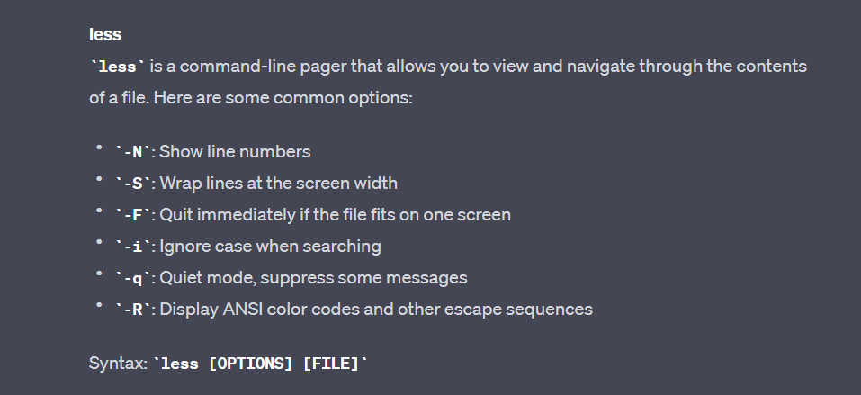

# **Lab Report 3 - Researching Commands (Week 5)**
* The task at hand is to select *one* of the bash commands that we learned in lecture: `find`, `less`, `grep`.
* Research 4 different options and give 2 examples using the `./technical` directory that we have been working with.
 
## Chat-GPT!
* Before I select a command to research, I was curious to see how effective Chat-GPT would be in helping me get the information for these commands.
* So I did exactly just that:
 
### Prompt:

 
### Chat-GPT Response:
#### `Grep`:

####  `Find`:

#### `Less`:

## **Grep:**
* For this lab, I decided to go with the `grep` command because it was the most confusing to me.
* Not only that, but I feel like its probably one of the more useful commands out of the three. (But I could be wrong)
* To start off, I asked Chat-GPT to give a description of the `grep` command:

