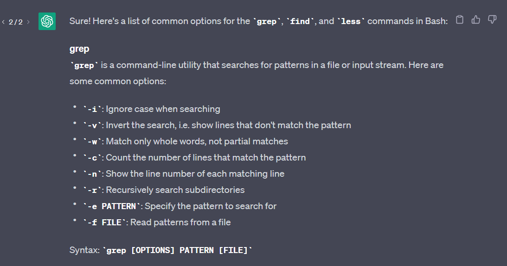

# **Lab Report 3 - Researching Commands (Week 5)**
* The task at hand is to select *one* of the bash commands that we learned in lecture: `find`, `less`, `grep`.
* Research 4 different options and give 2 examples using the `./technical` directory that we have been working with.
 
## Chat-GPT!
* Before I select a command to research, I was curious to see how effective Chat-GPT would be in helping me get the information for these commands.
* So I did exactly just that:
 
### Prompt:

 
### Chat-GPT Response:
#### `Grep`:

####  `Find`:

#### `Less`:

 
* Even though Chat-GPT doesn't give us every option, I still feel like its pretty interesting to see!

## **Grep:**
* For this lab, I decided to go with the `grep` command because it was the most confusing to me and so I want to tackle it to get a better understanding!
* From earlier, the commands that seemed interesting to me were `-v`, `-w`, `-n`, and `-m`
* **NOTE:** I did ask Chat-GPT again for a list of ALL options or flags using grep. To prevent this write-up from being too lengthy of Chat-GPT screenshots, I will briefly just say that only `-m` is the only 'new' option obtained from this search.

### `-v`
* According to AI, this option **inverts** our grep search, in which it will show lines that **don't** match the given pattern.
#### Example 1: 
```wc -l technical/911report/*.txt | sort
    108 technical/911report/preface.txt
    603 technical/911report/chapter-10.txt
    731 technical/911report/chapter-1.txt
    817 technical/911report/chapter-11.txt
    948 technical/911report/chapter-2.txt
   1036 technical/911report/chapter-8.txt
   1089 technical/911report/chapter-13.1.txt
   1204 technical/911report/chapter-5.txt
   1236 technical/911report/chapter-13.2.txt
   1539 technical/911report/chapter-12.txt
   1579 technical/911report/chapter-7.txt
   1718 technical/911report/chapter-13.3.txt
   1885 technical/911report/chapter-9.txt
   1898 technical/911report/chapter-6.txt
   2941 technical/911report/chapter-13.4.txt
   3159 technical/911report/chapter-3.txt
   3237 technical/911report/chapter-13.5.txt
  25728 total```


### -`w`
* Our good friend Chat-GPT describes this option as a way to match **whole words** as opposed to partial matches.


### `-n`
* AI says that this option can be used in our grep search to show each matching line's **line number** in the file.


### -`m NUM`
* Chat-GPT describes this option as a way to tell grep to stop searching after a certain number of matches.


