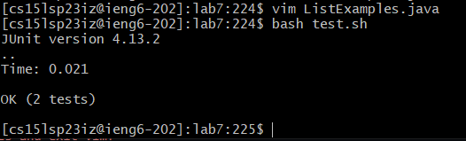
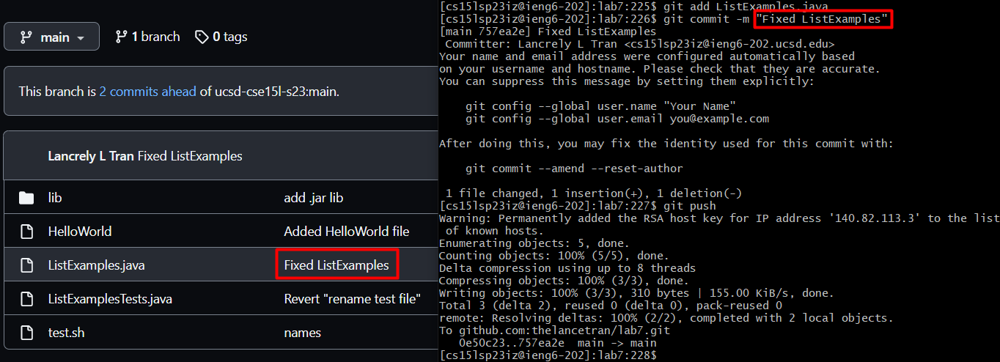

# **Lab Report 4 - Navigating with VIM (Week 7)**
* The goal of this lab report is to practice editing files only from the command line
* Use VIM commands to access file contents, make changes, and save them

## Steps
 
### **Setup:**
  1. Delete any existing forks of the repository you have on your account
  2. Fork the repository (onto your Github account)
  3. Start the timer!
 
### **Command Line:**
  4. Log into ieng6 (**Note:** In lab, I followed the steps in the `Generating SSH Keys for ieng6` section so that I do not have to enter my password to access my ieng6 account)
 

* Here, we want to connect to the remote server on the ieng6 account: `ssh <My ieng6 account>`
---
  5. Clone your fork of the repository from your Github account
 
* On the forked repository on Github, I copied the `<SSH link>` so that I could use it in the command: `git clone <SSH Link>`. 
* (**Note:** Earlier in lab, I followed the steps in the `Generating SSH Keys for GitHub` section so that I can clone, add, commit, and push to the repository from the ieng6 machine)
---
  6. Run the tests, demonstrating that they fail
 
 
* First, we need access to the files in the directory we just cloned, so we have to do: `cd lab7` 
* Next, we want to run the bash script that will compile our files and run the tests: `bash test.sh`
---
  7. Edit the code file to fix the failing test
 
* First, we go to the file to be edited (ListExamples.java): `vim ListExamples.java`
* We type the following:
    1. `?ind` --> `<Enter>`
       - Searching online for command hints, I was able to find the reverse search command which is `?`. 
       - Knowing from lab that the change we have to make is in the last occurrence of the word `index`, we type `ind` to make things faster and we can jump straight to it!
    2. `e` 
       - We move our cursor to the end of the word, so from `|index1` we go to `index|1`
    3. `x`
       - Using the `x` command, we can delete the character following our cursor
    4. `i` --> `2` --> `<Esc>`
       - We go into Insert Mode
       - Type 2 since we want to make the change from `index1` to `index2`
       - Return to Normal Mode
    6. `:wq` 
       - Finally, we save our changes and exit vim!
 ---
  8. Run the tests, demonstrating that they now succeed
 
* After changing `ListExamples.java` in VIM, we can run the same command above to test our fix: `bash test.sh` 
---
  9. Commit and push the resulting change to your Github account

* Here, we use `git add ListExamples.java` to stage the file to be ready to push to our repo on Github.
* Then, we use `git commit -m "<message>"` to save the changes on our local repository with a message describing the changes.
* Lastly, we use `git push` to push our changes onto our Github repo.

## Conclusion/Reflection
To me, learning about VIM was pretty fascinating. During lecture when Professor Politz stated that he was debating about teaching VIM, even mentioning that he didn't teach it last quarter but chose to do so this quarter, I thought it was interesting to be able to see why he would have this debate. Although I could simply do these things easily like how we are all used to like opening up the java file in our favorite editor (VS Code) and make the changes there, I could see the advantages of VIM in that it can be extremely quick with enough experience. To be honest, I didn't even know about VIM before learning about it in this class, so I think just generally it was cool to be introduced to new command line text editor.
