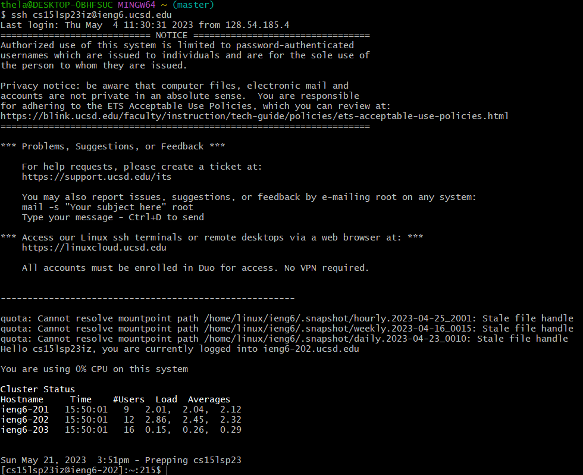
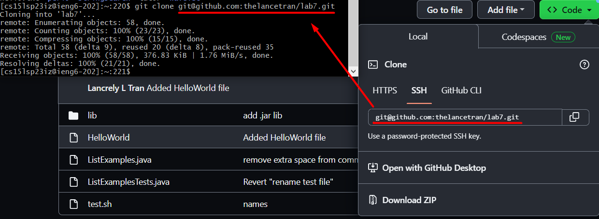
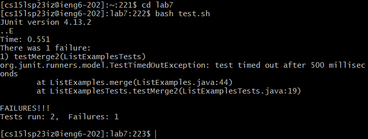
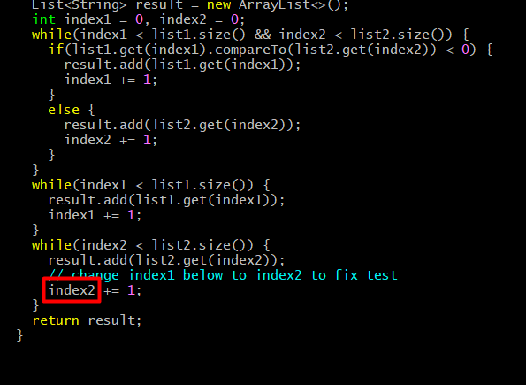

# **Lab Report 4 - Navigating with VIM (Week 7)**
* The goal of this lab report is to practice editing files only from the command line
* Use VIM commands to access file contents, make changes, and save them

## Steps
 
### **Setup:**
  1. Delete any existing forks of the repository you have on your account
  2. Fork the repository (onto your Github account)
  3. Start the timer!
 
### **Command Line:**
  4. Log into ieng6 (**Note:** In lab, I followed the steps in the `Generating SSH Keys for ieng6` section so that I do not have to enter my password to access my ieng6 account)

* Here, we want to connect to the remote server on the ieng6 account: `ssh <My ieng6 account>`
  5. Clone your fork of the repository from your Github account

* On the forked repository on Github, I copied the `<SSH link>` so that I could use it in the command: `git clone <SSH Link>`. 
* (**Note:** Earlier in lab, I followed the steps in the `Generating SSH Keys for GitHub` section so that I can clone, add, commit, and push to the repository from the ieng6 machine)
  6. Run the tests, demonstrating that they fail

* First, we need access to the files in the directory we just cloned, so we have to do: `cd lab7` 
* Next, we want to run the bash script that will compile our files and run the tests: `bash test.sh` 
  7. Edit the code file to fix the failing test

* First, we go to the file to be edited (ListExamples.java): `vim ListExamples.java`
* We type the following:
    1. `?ind` --> `<Enter>`
 - Searching online for command hints, I was able to find the reverse search command which is `?`. 
 - Knowing from lab that the change we have to make is in the last occurrence of the word `index`, we type `ind` to make things shorter and faster!
    2. `e` 
    3. `x`
    4. `i` --> `2` --> `<Esc>`
    5. `:wq` 
  8. 
