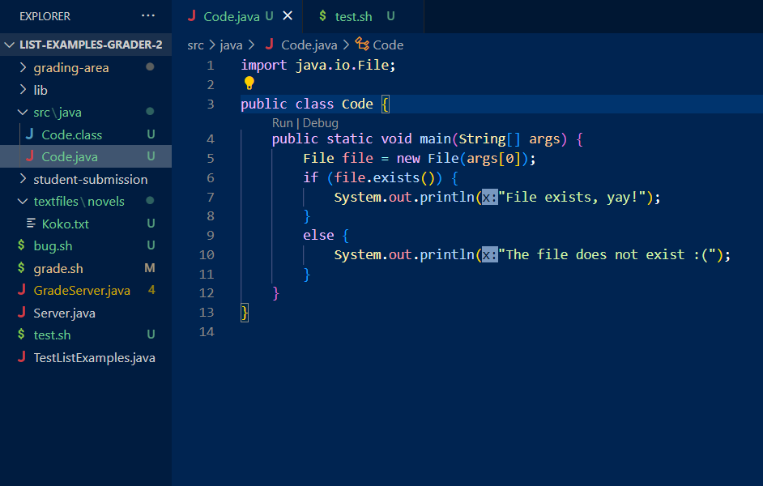
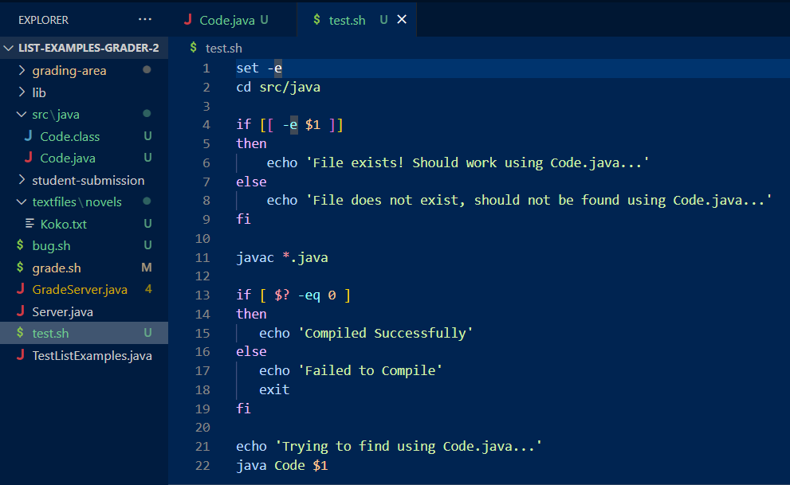
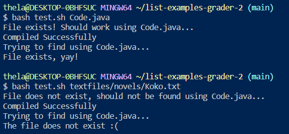
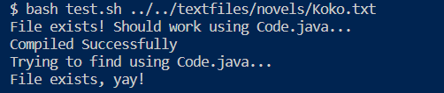
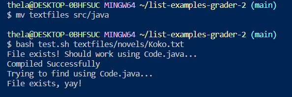

# **Lab Report 5 - Putting It All Together (Week 9)**
* Mimic an Edstem debugging scenario between a student and TA
* Reflect on the latter half of the quarter and describe what was learned

## Debugging Scenario

### 1. Student Post
- **Environment:** Windows
- **Description:** I am running a bash script which checks if a given file and its path exists. On top of that, I run `Code.java` which essentially does the same thing. When I run it with the argument `Code.java`, I expect it to work since it is the name of the java file. But when I run the directory `textfiles/novels/Koko.txt`, it doesn't appear to work and prints that it does not exist. But if you look at the attached screenshot, the directory is clearly there and the file and its path exists.
- **Failure-Inducing Input:** When I run the directory `textfiles/novels/Koko.txt`, it doesn't appear to work and prints that it does not exist. I ran the following on the terminal: `bash test.sh textfiles/novels/Koko.txt`. There is no error messages, so it's hard to tell what the error is. My guess would be that it may have to do with the logic behind my script and java code...

### 2. TA Follow-Up
- Hi, from what it seems like, the issue doesn't stem from your code. I think that the logic behind it is fine and that it works as intended. The error that is causing the directory `textfiles/novels/Koko.txt` to print "it does not exist" as you said, is because the directory is incorrect.
- Take a look at your bash script. Note that you have `cd src/java` so that you can compile and run your java program. Then, you try running it with `Code.java`, which works because you are in that directory (i.e. `src/java/Code.java`)
- Based on where the  `textfiles` directory is from your screenshot, you would have to prepend `..` twice to go back to the base directory to access `textfiles`
- Try that and see if it works!

### 3. Student Fix/Resolution

- It worked! Thank you so much! I was so convinced that the directory was correct that I didn't even think about it. It makes sense now and its clear to me that the bug was **simply the directory being inaccurate**, in which it was in a different one than the working directory.
- Another fix that I did to avoid having to do `../..` was moving the `textfiles` directory into the working directory. I ran `mv textfiles src/java` on the terminal to accomplish this task. Then, running the old command `bash test.sh textfiles/novels/Koko.txt` works!

## Reflection

I think this course has taught me a lot in terms of setting up a solid programming foundation. A lot of the approach in learning programming (at least for me) is using the black box method, where you kind of just accept that things work and focus on your goal to get whatever program to run. And so I feel like from 15L, being able to see the details of what's going on through the command line is really cool and interesting. An example of this is during Week 9 when we went over using the debugger (jdb) on the command line to kind of "freeze" our program and check what exactly is happening (in the lecture case being checking the addresses of the variables). But besides that, learning git I feel like was interesting and I assume it will be very helpful. And then lastly, I feel like writing these lab reports made me a stronger programmer in the sense that I can communicate my code more effectively and be more thorough in explaining different concepts. Overall, I felt that this class was a nice learning experience and enjoyable.
